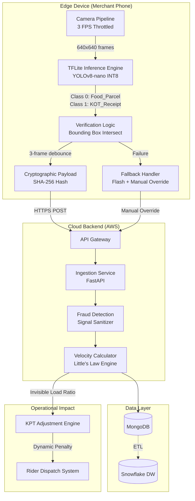
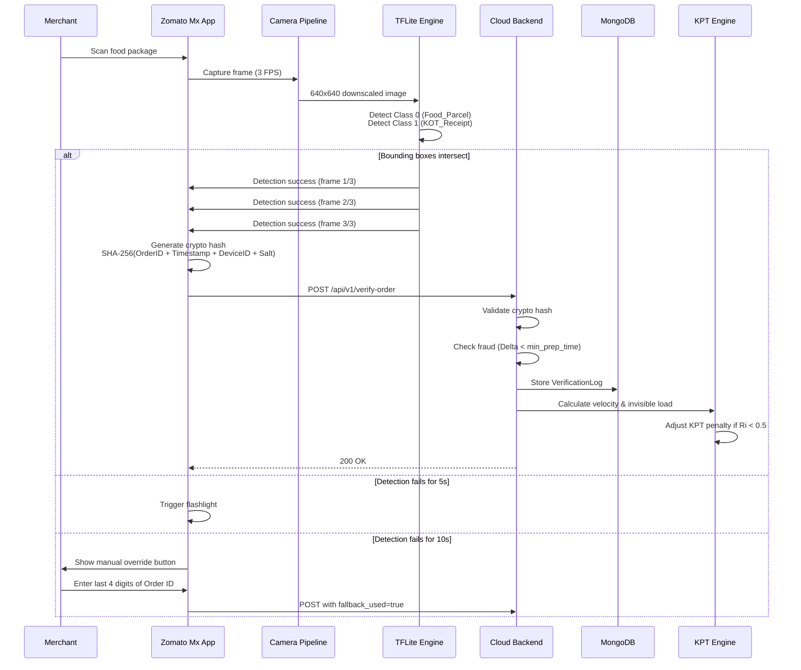

# Design Document: Zomato EdgeVision - Cryptographic Proof-of-Packaging

## Overview

Zomato EdgeVision is an edge-computing system that replaces manual "Food Ready" merchant signals with AI-verified timestamps using cryptographic proof. The system operates under strict constraints: zero cloud video streaming (all inference happens on-device), sub-200ms latency, and zero new hardware requirements. It analyzes kitchen throughput velocity using Little's Law to detect invisible load from dine-in customers and competitor orders, dynamically adjusting Kitchen Prep Time (KPT) based on inferred kitchen congestion. The architecture separates edge processing (mobile device) from cloud analytics (backend microservices) to bypass network bottlenecks in Indian kitchen environments.

The system consists of three primary components: (1) Edge Client running within the Zomato Mx mobile app that captures camera frames, performs local object detection, and generates cryptographic payloads; (2) Cloud Backend that ingests verification events, detects fraud patterns, and calculates throughput velocity; (3) Analytics Engine that applies Little's Law to infer invisible kitchen load and dynamically adjust delivery ETAs.

## Architecture




## Main Workflow Sequence



## Components and Interfaces

### Component 1: Edge Camera Pipeline

**Purpose**: Capture and preprocess camera frames for inference while minimizing battery consumption and computational load.

**Interface**:
```typescript
interface CameraPipeline {
  startCapture(config: CaptureConfig): Promise<void>
  stopCapture(): void
  onFrameReady(callback: (frame: ImageFrame) => void): void
  getCurrentFPS(): number
}

interface CaptureConfig {
  targetFPS: number          // Must be 3 FPS
  resolution: Resolution     // Must be 640x640
  format: ImageFormat        // RGB or YUV
}

interface ImageFrame {
  data: Uint8Array
  width: number
  height: number
  timestamp: number
}
```

**Responsibilities**:
- Throttle frame capture to exactly 3 FPS to prevent battery drain
- Downscale captured frames to 640x640 resolution before inference
- Maintain frame buffer for temporal consistency checks
- Handle camera permission requests and lifecycle management


### Component 2: TFLite Inference Engine

**Purpose**: Execute on-device object detection to identify food parcels and KOT receipts without sending frames to the cloud.

**Interface**:
```typescript
interface InferenceEngine {
  initialize(modelPath: string): Promise<void>
  runInference(frame: ImageFrame): Promise<DetectionResult>
  dispose(): void
}

interface DetectionResult {
  detections: Detection[]
  inferenceTimeMs: number
  confidence: number
}

interface Detection {
  classId: number           // 0: Food_Parcel, 1: KOT_Receipt
  className: string
  boundingBox: BoundingBox
  confidence: number
}

interface BoundingBox {
  x: number                 // Top-left x coordinate
  y: number                 // Top-left y coordinate
  width: number
  height: number
}
```

**Responsibilities**:
- Load quantized YOLOv8-nano model (INT8 precision) optimized for mobile NPUs
- Execute inference within 200ms latency budget
- Return bounding boxes for detected objects with confidence scores
- Manage model lifecycle and memory allocation

### Component 3: Verification Logic Gate

**Purpose**: Implement spatial and temporal validation to ensure receipt is physically attached to food package.

**Interface**:
```typescript
interface VerificationLogic {
  processDetection(result: DetectionResult): VerificationState
  reset(): void
  getConsecutiveSuccessCount(): number
}

interface VerificationState {
  verified: boolean
  consecutiveFrames: number
  foodParcelBox: BoundingBox | null
  receiptBox: BoundingBox | null
  spatialIntersection: boolean
}
```

**Responsibilities**:
- Check if both Class 0 (Food_Parcel) and Class 1 (KOT_Receipt) are detected
- Validate spatial constraint: receipt bounding box must intersect or be contained within food parcel box
- Implement 3-frame debouncer to prevent motion-blur false positives
- Reset state when verification fails


### Component 4: Cryptographic Payload Generator

**Purpose**: Generate secure, tamper-proof verification payloads without transmitting sensitive image data.

**Interface**:
```typescript
interface PayloadGenerator {
  generatePayload(
    orderId: string,
    timestamp: number,
    confidenceScore: number,
    fallbackUsed: boolean
  ): VerificationPayload
  
  validatePayload(payload: VerificationPayload): boolean
}

interface VerificationPayload {
  order_id: string
  verified_timestamp: number
  confidence_score: number
  crypto_hash: string
  fallback_used: boolean
  device_id?: string
}
```

**Responsibilities**:
- Generate SHA-256 hash: `Hash(OrderID + Timestamp + MerchantDeviceID + SecretSalt)`
- Pull active Order_ID from app UI state
- Create Unix timestamp at moment of verification
- Construct JSON payload without including raw image data
- Validate hash integrity on client side before transmission

### Component 5: Fallback Handler

**Purpose**: Provide graceful degradation when AI inference fails due to poor lighting or camera issues.

**Interface**:
```typescript
interface FallbackHandler {
  startFailureTimer(): void
  stopFailureTimer(): void
  onFlashlightTrigger(callback: () => void): void
  onManualOverride(callback: (orderIdSuffix: string) => void): void
}

interface FallbackConfig {
  flashlightDelaySeconds: number    // Must be 5
  manualOverrideDelaySeconds: number // Must be 10
}
```

**Responsibilities**:
- Track continuous inference failure duration
- Trigger device flashlight API at T+5 seconds
- Display manual override UI at T+10 seconds
- Validate merchant input (last 4 digits of Order ID)
- Set `fallback_used: true` flag in payload


### Component 6: Ingestion Microservice (Backend)

**Purpose**: Receive high-throughput verification payloads from edge devices and validate authenticity.

**Interface**:
```python
from fastapi import FastAPI, HTTPException
from pydantic import BaseModel
from typing import Optional

class VerificationPayload(BaseModel):
    order_id: str
    verified_timestamp: int
    confidence_score: float
    crypto_hash: str
    fallback_used: bool
    device_id: Optional[str] = None

class IngestionService:
    async def verify_order(self, payload: VerificationPayload) -> dict:
        """
        Ingest and validate verification payload from edge device.
        
        Preconditions:
        - payload.order_id is non-empty string
        - payload.verified_timestamp is valid Unix timestamp
        - payload.confidence_score is between 0.0 and 1.0
        - payload.crypto_hash is 64-character hex string (SHA-256)
        
        Postconditions:
        - Returns success response if hash validation passes
        - Raises HTTPException(401) if hash validation fails
        - Stores payload in MongoDB if validation succeeds
        - Processing completes within 200ms
        """
        pass
    
    def validate_crypto_hash(
        self, 
        order_id: str, 
        timestamp: int, 
        device_id: str, 
        received_hash: str
    ) -> bool:
        """
        Validate cryptographic hash to prevent spoofed requests.
        
        Preconditions:
        - All parameters are non-null
        - received_hash is 64-character hex string
        - SECRET_SALT is configured in environment
        
        Postconditions:
        - Returns True if computed hash matches received hash
        - Returns False otherwise
        - No side effects
        """
        pass
```

**Responsibilities**:
- Expose async POST endpoint `/api/v1/verify-order`
- Validate crypto_hash to ensure payload authenticity
- Handle high-throughput concurrent requests (1000+ req/sec)
- Forward validated payloads to fraud detection layer


### Component 7: Fraud Detection (Signal Sanitizer)

**Purpose**: Detect and flag fraudulent verification attempts where merchants scan empty bags prematurely.

**Interface**:
```python
from datetime import datetime
from enum import Enum

class FraudFlag(Enum):
    FRAUD_EMPTY_BAG = "FRAUD_EMPTY_BAG"
    FRAUD_GHOST_SCAN = "FRAUD_GHOST_SCAN"
    FRAUD_TEMPORAL_ANOMALY = "FRAUD_TEMPORAL_ANOMALY"
    CLEAN = None

class FraudDetector:
    async def analyze_verification(
        self, 
        order_id: str, 
        verified_timestamp: int
    ) -> FraudFlag:
        """
        Analyze verification event for fraud patterns.
        
        Preconditions:
        - order_id exists in orders database
        - verified_timestamp is valid Unix timestamp
        - Order has order_creation_timestamp and item_list
        
        Postconditions:
        - Returns FraudFlag indicating fraud type or CLEAN
        - Does not modify order state
        - Completes within 50ms
        """
        pass
    
    async def get_minimum_prep_time(self, item_list: list[str]) -> int:
        """
        Calculate minimum physically possible prep time for order items.
        
        Preconditions:
        - item_list is non-empty
        - All items exist in menu database with prep_time_minutes
        
        Postconditions:
        - Returns maximum prep time among all items (in seconds)
        - Returns value >= 60 (minimum 1 minute)
        
        Loop Invariants:
        - max_prep_time is always the maximum seen so far
        """
        pass
    
    def check_temporal_validity(
        self, 
        delta_seconds: int, 
        min_prep_time: int
    ) -> bool:
        """
        Check if verification timestamp is temporally valid.
        
        Preconditions:
        - delta_seconds >= 0
        - min_prep_time > 0
        
        Postconditions:
        - Returns True if delta_seconds >= min_prep_time
        - Returns False if delta_seconds < min_prep_time (fraud)
        """
        pass
```

**Responsibilities**:
- Calculate `Delta = verified_timestamp - order_creation_timestamp`
- Query menu database for minimum prep time of order items
- Flag as `FRAUD_EMPTY_BAG` if Delta < minimum_prep_time
- Store flagged events in database but exclude from KPT calculations
- Detect "ghost scan" patterns (scan before rider GPS arrival)


### Component 8: Velocity Calculator (Little's Law Engine)

**Purpose**: Calculate kitchen throughput velocity and infer invisible load from competitor platforms and dine-in customers.

**Interface**:
```python
from dataclasses import dataclass

@dataclass
class VelocityMetrics:
    baseline_velocity: float      # Orders per hour (historical)
    current_velocity: float        # Orders per hour (recent 15 min)
    invisible_load_ratio: float    # Ri = Vc / Vb
    kpt_penalty_minutes: int       # Dynamic penalty to add

class VelocityCalculator:
    async def calculate_merchant_velocity(
        self, 
        merchant_id: str
    ) -> VelocityMetrics:
        """
        Calculate throughput velocity and invisible load for merchant.
        
        Preconditions:
        - merchant_id exists in database
        - Merchant has historical verification data (>= 7 days)
        - Current time window has >= 1 verification event
        
        Postconditions:
        - Returns VelocityMetrics with all fields populated
        - baseline_velocity > 0
        - current_velocity >= 0
        - invisible_load_ratio >= 0
        - kpt_penalty_minutes >= 0
        """
        pass
    
    async def get_baseline_velocity(
        self, 
        merchant_id: str, 
        time_window: str = "7PM-8PM",
        day_of_week: str = "Friday"
    ) -> float:
        """
        Calculate historical baseline velocity (Vb).
        
        Preconditions:
        - merchant_id has >= 4 weeks of historical data
        - time_window is valid format "HH:MM-HH:MM"
        - day_of_week is valid weekday name
        
        Postconditions:
        - Returns average orders/hour for specified time window
        - Returns value > 0
        - Excludes fraud-flagged verifications
        
        Loop Invariants:
        - Running sum of orders is accurate for all processed weeks
        - Week count is accurate for all processed weeks
        """
        pass
    
    async def get_current_velocity(
        self, 
        merchant_id: str, 
        lookback_minutes: int = 15
    ) -> float:
        """
        Calculate current velocity (Vc) from recent verifications.
        
        Preconditions:
        - merchant_id is valid
        - lookback_minutes > 0
        - Current time >= lookback_minutes from merchant's first order today
        
        Postconditions:
        - Returns orders/hour extrapolated from recent window
        - Returns 0.0 if no verifications in window
        - Excludes fraud-flagged verifications
        
        Loop Invariants:
        - Count of valid verifications is accurate for all processed events
        """
        pass
    
    def calculate_invisible_load_ratio(
        self, 
        current_velocity: float, 
        baseline_velocity: float
    ) -> float:
        """
        Calculate invisible load ratio: Ri = Vc / Vb
        
        Preconditions:
        - baseline_velocity > 0
        - current_velocity >= 0
        
        Postconditions:
        - Returns ratio >= 0
        - Returns 1.0 if current_velocity == baseline_velocity
        - Returns < 1.0 if kitchen is slower than baseline
        - Returns > 1.0 if kitchen is faster than baseline
        """
        pass
    
    def calculate_kpt_penalty(self, invisible_load_ratio: float) -> int:
        """
        Calculate KPT penalty based on invisible load ratio.
        
        Preconditions:
        - invisible_load_ratio >= 0
        
        Postconditions:
        - Returns 0 if invisible_load_ratio >= 0.8 (normal operation)
        - Returns penalty minutes if invisible_load_ratio < 0.5 (congestion)
        - Penalty scales inversely with ratio
        - Returns value in range [0, 30] minutes
        """
        pass
```

**Responsibilities**:
- Run background worker every 5 minutes for active merchants
- Calculate baseline velocity (Vb) from historical data
- Calculate current velocity (Vc) from recent 15-minute window
- Compute invisible load ratio: Ri = Vc / Vb
- Apply dynamic KPT penalty when Ri < 0.5 (indicating congestion)
- Update MerchantVelocityState collection in MongoDB


## Data Models

### Model 1: VerificationLog

```typescript
interface VerificationLog {
  _id: ObjectId
  order_id: string
  merchant_id: string
  verified_timestamp: Date
  confidence_score: number
  fallback_used: boolean
  fraud_flag: FraudFlag | null
  processing_time_ms: number
  device_id?: string
  created_at: Date
}
```

**Validation Rules**:
- `order_id` must match pattern `^ZOM-[0-9]{5,}$`
- `merchant_id` must be non-empty string
- `verified_timestamp` must be valid ISO date
- `confidence_score` must be in range [0.0, 1.0]
- `fallback_used` must be boolean
- `fraud_flag` must be one of: `FRAUD_EMPTY_BAG`, `FRAUD_GHOST_SCAN`, `FRAUD_TEMPORAL_ANOMALY`, or null
- `processing_time_ms` must be positive integer
- `created_at` defaults to current timestamp

**Indexes**:
- Compound index on `(merchant_id, verified_timestamp)` for velocity queries
- Index on `order_id` for fraud detection lookups
- Index on `fraud_flag` for analytics queries

### Model 2: MerchantVelocityState

```typescript
interface MerchantVelocityState {
  _id: ObjectId
  merchant_id: string
  current_velocity_orders_per_hour: number
  baseline_velocity_orders_per_hour: number
  invisible_load_ratio: number
  active_kpt_penalty_minutes: number
  last_calculated: Date
  calculation_window_start: Date
  calculation_window_end: Date
}
```

**Validation Rules**:
- `merchant_id` must be unique (primary key)
- `current_velocity_orders_per_hour` must be >= 0
- `baseline_velocity_orders_per_hour` must be > 0
- `invisible_load_ratio` must be >= 0
- `active_kpt_penalty_minutes` must be in range [0, 30]
- `last_calculated` must be recent (within last 10 minutes)
- `calculation_window_end` must be > `calculation_window_start`

**Indexes**:
- Unique index on `merchant_id`
- Index on `last_calculated` for stale data cleanup
- Index on `active_kpt_penalty_minutes` for operational dashboards


### Model 3: Order (Reference Schema)

```typescript
interface Order {
  _id: ObjectId
  order_id: string
  merchant_id: string
  customer_id: string
  order_creation_timestamp: Date
  item_list: OrderItem[]
  status: OrderStatus
  assigned_rider_id?: string
  rider_arrival_timestamp?: Date
}

interface OrderItem {
  item_id: string
  item_name: string
  quantity: number
  prep_time_minutes: number
}

enum OrderStatus {
  PENDING = "PENDING",
  PREPARING = "PREPARING",
  READY = "READY",
  PICKED_UP = "PICKED_UP",
  DELIVERED = "DELIVERED"
}
```

**Validation Rules**:
- `order_id` must be unique
- `item_list` must be non-empty array
- `prep_time_minutes` for each item must be > 0
- `order_creation_timestamp` must be in the past
- `rider_arrival_timestamp` must be >= `order_creation_timestamp` if present

### Model 4: MenuItem (Reference Schema)

```typescript
interface MenuItem {
  _id: ObjectId
  item_id: string
  item_name: string
  merchant_id: string
  category: string
  prep_time_minutes: number
  complexity_score: number
}
```

**Validation Rules**:
- `item_id` must be unique per merchant
- `prep_time_minutes` must be in range [1, 120]
- `complexity_score` must be in range [1, 10]

## Algorithmic Pseudocode

### Algorithm 1: Bounding Box Intersection Check

```python
def check_bounding_box_intersection(
    food_box: BoundingBox, 
    receipt_box: BoundingBox
) -> bool:
    """
    Check if receipt bounding box intersects or is contained within food parcel box.
    
    INPUT: food_box (BoundingBox), receipt_box (BoundingBox)
    OUTPUT: boolean indicating intersection or containment
    
    PRECONDITIONS:
    - food_box has valid coordinates (x, y, width, height all >= 0)
    - receipt_box has valid coordinates (x, y, width, height all >= 0)
    - width and height are positive for both boxes
    
    POSTCONDITIONS:
    - Returns True if boxes intersect or receipt is fully contained in food box
    - Returns False if boxes are completely separate
    - No side effects on input parameters
    """
    
    # Calculate boundaries of food parcel box
    food_left = food_box.x
    food_right = food_box.x + food_box.width
    food_top = food_box.y
    food_bottom = food_box.y + food_box.height
    
    # Calculate boundaries of receipt box
    receipt_left = receipt_box.x
    receipt_right = receipt_box.x + receipt_box.width
    receipt_top = receipt_box.y
    receipt_bottom = receipt_box.y + receipt_box.height
    
    # Check for intersection using separating axis theorem
    # Boxes do NOT intersect if one is completely to the left/right/above/below the other
    if receipt_right < food_left:
        return False  # Receipt is completely to the left
    if receipt_left > food_right:
        return False  # Receipt is completely to the right
    if receipt_bottom < food_top:
        return False  # Receipt is completely above
    if receipt_top > food_bottom:
        return False  # Receipt is completely below
    
    # If none of the separation conditions are true, boxes must intersect
    return True
```


### Algorithm 2: Three-Frame Debouncer

```python
def process_detection_with_debounce(
    detection_result: DetectionResult,
    state: VerificationState
) -> tuple[bool, VerificationState]:
    """
    Process detection result with 3-frame debouncing to prevent false positives.
    
    INPUT: detection_result (DetectionResult), state (VerificationState)
    OUTPUT: tuple of (verification_success: bool, updated_state: VerificationState)
    
    PRECONDITIONS:
    - detection_result contains valid detections list
    - state is initialized VerificationState object
    - state.consecutiveFrames is in range [0, 2]
    
    POSTCONDITIONS:
    - Returns (True, updated_state) if 3 consecutive successful detections
    - Returns (False, updated_state) otherwise
    - updated_state.consecutiveFrames is in range [0, 3]
    - State is reset if current detection fails
    
    LOOP INVARIANTS:
    - food_parcel and kot_receipt are None or valid Detection objects
    - Only one detection per class is considered (highest confidence)
    """
    
    # Extract detections by class
    food_parcel = None
    kot_receipt = None
    
    for detection in detection_result.detections:
        if detection.classId == 0:  # Food_Parcel
            if food_parcel is None or detection.confidence > food_parcel.confidence:
                food_parcel = detection
        elif detection.classId == 1:  # KOT_Receipt
            if kot_receipt is None or detection.confidence > kot_receipt.confidence:
                kot_receipt = detection
    
    # Check if both classes detected
    if food_parcel is None or kot_receipt is None:
        # Reset state on failure
        state.consecutiveFrames = 0
        state.spatialIntersection = False
        state.foodParcelBox = None
        state.receiptBox = None
        return (False, state)
    
    # Check spatial intersection
    intersection = check_bounding_box_intersection(
        food_parcel.boundingBox,
        kot_receipt.boundingBox
    )
    
    if not intersection:
        # Reset state on spatial validation failure
        state.consecutiveFrames = 0
        state.spatialIntersection = False
        state.foodParcelBox = None
        state.receiptBox = None
        return (False, state)
    
    # Increment consecutive success counter
    state.consecutiveFrames += 1
    state.spatialIntersection = True
    state.foodParcelBox = food_parcel.boundingBox
    state.receiptBox = kot_receipt.boundingBox
    
    # Check if we've reached 3 consecutive frames
    if state.consecutiveFrames >= 3:
        verification_success = True
        # Reset state after successful verification
        state.consecutiveFrames = 0
    else:
        verification_success = False
    
    return (verification_success, state)
```


### Algorithm 3: Cryptographic Hash Generation

```python
import hashlib
from datetime import datetime

def generate_crypto_hash(
    order_id: str,
    timestamp: int,
    device_id: str,
    secret_salt: str
) -> str:
    """
    Generate SHA-256 cryptographic hash for verification payload.
    
    INPUT: order_id (str), timestamp (int), device_id (str), secret_salt (str)
    OUTPUT: 64-character hexadecimal hash string
    
    PRECONDITIONS:
    - order_id is non-empty string
    - timestamp is valid Unix timestamp (positive integer)
    - device_id is non-empty string
    - secret_salt is configured and non-empty
    
    POSTCONDITIONS:
    - Returns 64-character lowercase hexadecimal string
    - Same inputs always produce same output (deterministic)
    - Hash is cryptographically secure (SHA-256)
    - No side effects
    """
    
    # Concatenate all components with delimiter
    payload_string = f"{order_id}|{timestamp}|{device_id}|{secret_salt}"
    
    # Convert string to bytes
    payload_bytes = payload_string.encode('utf-8')
    
    # Generate SHA-256 hash
    hash_object = hashlib.sha256(payload_bytes)
    
    # Return hexadecimal representation
    return hash_object.hexdigest()


def validate_crypto_hash(
    order_id: str,
    timestamp: int,
    device_id: str,
    received_hash: str,
    secret_salt: str
) -> bool:
    """
    Validate received cryptographic hash against computed hash.
    
    INPUT: order_id, timestamp, device_id, received_hash, secret_salt
    OUTPUT: boolean indicating hash validity
    
    PRECONDITIONS:
    - All parameters are non-null
    - received_hash is 64-character hexadecimal string
    - secret_salt matches the salt used during generation
    
    POSTCONDITIONS:
    - Returns True if computed hash matches received hash
    - Returns False otherwise
    - Comparison is timing-attack resistant
    - No side effects
    """
    
    # Compute expected hash
    expected_hash = generate_crypto_hash(order_id, timestamp, device_id, secret_salt)
    
    # Use constant-time comparison to prevent timing attacks
    if len(received_hash) != len(expected_hash):
        return False
    
    # Constant-time comparison
    result = 0
    for expected_char, received_char in zip(expected_hash, received_hash):
        result |= ord(expected_char) ^ ord(received_char)
    
    return result == 0
```


### Algorithm 4: Fraud Detection (Temporal Validation)

```python
async def detect_fraud(
    order_id: str,
    verified_timestamp: int,
    orders_db: Database,
    menu_db: Database
) -> FraudFlag:
    """
    Detect fraudulent verification attempts using temporal analysis.
    
    INPUT: order_id, verified_timestamp, orders_db, menu_db
    OUTPUT: FraudFlag enum value
    
    PRECONDITIONS:
    - order_id exists in orders_db
    - verified_timestamp is valid Unix timestamp
    - orders_db and menu_db are connected and accessible
    
    POSTCONDITIONS:
    - Returns FRAUD_EMPTY_BAG if Delta < minimum_prep_time
    - Returns CLEAN if validation passes
    - Completes within 50ms
    - No modifications to database state
    
    LOOP INVARIANTS:
    - max_prep_time is always the maximum prep time seen so far
    - All processed items have valid prep_time_minutes > 0
    """
    
    # Fetch order details
    order = await orders_db.orders.find_one({"order_id": order_id})
    
    if order is None:
        return FraudFlag.FRAUD_TEMPORAL_ANOMALY
    
    # Calculate time delta
    order_creation_timestamp = int(order["order_creation_timestamp"].timestamp())
    delta_seconds = verified_timestamp - order_creation_timestamp
    
    # Handle negative delta (clock skew or fraud)
    if delta_seconds < 0:
        return FraudFlag.FRAUD_TEMPORAL_ANOMALY
    
    # Calculate minimum prep time from order items
    max_prep_time = 0
    
    for item in order["item_list"]:
        item_id = item["item_id"]
        
        # Fetch menu item details
        menu_item = await menu_db.menu_items.find_one({
            "item_id": item_id,
            "merchant_id": order["merchant_id"]
        })
        
        if menu_item is None:
            continue
        
        prep_time_minutes = menu_item["prep_time_minutes"]
        
        # Track maximum prep time (bottleneck item)
        if prep_time_minutes > max_prep_time:
            max_prep_time = prep_time_minutes
    
    # Convert to seconds
    minimum_prep_time_seconds = max_prep_time * 60
    
    # Apply minimum threshold (at least 1 minute)
    if minimum_prep_time_seconds < 60:
        minimum_prep_time_seconds = 60
    
    # Check temporal validity
    if delta_seconds < minimum_prep_time_seconds:
        return FraudFlag.FRAUD_EMPTY_BAG
    
    return FraudFlag.CLEAN
```


### Algorithm 5: Velocity Calculation (Little's Law)

```python
from datetime import datetime, timedelta
from typing import List

async def calculate_velocity_metrics(
    merchant_id: str,
    db: Database
) -> VelocityMetrics:
    """
    Calculate kitchen throughput velocity using Little's Law.
    
    INPUT: merchant_id (str), db (Database)
    OUTPUT: VelocityMetrics object
    
    PRECONDITIONS:
    - merchant_id exists in database
    - Merchant has >= 7 days of historical verification data
    - Database connection is active
    
    POSTCONDITIONS:
    - Returns VelocityMetrics with all fields populated
    - baseline_velocity > 0
    - current_velocity >= 0
    - invisible_load_ratio >= 0
    - kpt_penalty_minutes in range [0, 30]
    
    LOOP INVARIANTS (for baseline calculation):
    - total_orders is cumulative sum of all valid orders
    - week_count is accurate count of processed weeks
    - All processed verifications have fraud_flag == None
    """
    
    # Step 1: Calculate Baseline Velocity (Vb)
    # Historical average for Friday 7PM-8PM over last 4 weeks
    baseline_velocity = await calculate_baseline_velocity(
        merchant_id=merchant_id,
        db=db,
        time_window_start=19,  # 7 PM
        time_window_end=20,    # 8 PM
        day_of_week=4,         # Friday (0=Monday)
        lookback_weeks=4
    )
    
    # Step 2: Calculate Current Velocity (Vc)
    # Moving average of last 15 minutes, extrapolated to hourly rate
    current_velocity = await calculate_current_velocity(
        merchant_id=merchant_id,
        db=db,
        lookback_minutes=15
    )
    
    # Step 3: Calculate Invisible Load Ratio (Ri)
    if baseline_velocity == 0:
        invisible_load_ratio = 1.0  # Default to normal operation
    else:
        invisible_load_ratio = current_velocity / baseline_velocity
    
    # Step 4: Calculate KPT Penalty
    kpt_penalty_minutes = calculate_kpt_penalty(invisible_load_ratio)
    
    # Step 5: Store results in database
    await db.merchant_velocity_state.update_one(
        {"merchant_id": merchant_id},
        {
            "$set": {
                "current_velocity_orders_per_hour": current_velocity,
                "baseline_velocity_orders_per_hour": baseline_velocity,
                "invisible_load_ratio": invisible_load_ratio,
                "active_kpt_penalty_minutes": kpt_penalty_minutes,
                "last_calculated": datetime.utcnow()
            }
        },
        upsert=True
    )
    
    return VelocityMetrics(
        baseline_velocity=baseline_velocity,
        current_velocity=current_velocity,
        invisible_load_ratio=invisible_load_ratio,
        kpt_penalty_minutes=kpt_penalty_minutes
    )


async def calculate_baseline_velocity(
    merchant_id: str,
    db: Database,
    time_window_start: int,
    time_window_end: int,
    day_of_week: int,
    lookback_weeks: int
) -> float:
    """
    Calculate historical baseline velocity for specific time window.
    
    PRECONDITIONS:
    - time_window_start in range [0, 23]
    - time_window_end > time_window_start
    - day_of_week in range [0, 6] (Monday=0, Sunday=6)
    - lookback_weeks > 0
    
    POSTCONDITIONS:
    - Returns average orders per hour for time window
    - Returns value >= 0
    - Excludes fraud-flagged verifications
    
    LOOP INVARIANTS:
    - total_orders is cumulative sum for all processed weeks
    - valid_weeks counts only weeks with >= 1 verification
    """
    
    total_orders = 0
    valid_weeks = 0
    
    current_date = datetime.utcnow()
    
    # Iterate through each week in lookback period
    for week_offset in range(lookback_weeks):
        # Calculate target date (go back week by week)
        target_date = current_date - timedelta(weeks=week_offset + 1)
        
        # Find the target day of week
        days_until_target = (target_date.weekday() - day_of_week) % 7
        target_date = target_date - timedelta(days=days_until_target)
        
        # Define time window boundaries
        window_start = target_date.replace(
            hour=time_window_start,
            minute=0,
            second=0,
            microsecond=0
        )
        window_end = target_date.replace(
            hour=time_window_end,
            minute=0,
            second=0,
            microsecond=0
        )
        
        # Query verifications in this window
        count = await db.verification_logs.count_documents({
            "merchant_id": merchant_id,
            "verified_timestamp": {
                "$gte": window_start,
                "$lt": window_end
            },
            "fraud_flag": None  # Exclude fraud
        })
        
        if count > 0:
            total_orders += count
            valid_weeks += 1
    
    # Calculate average orders per hour
    if valid_weeks == 0:
        return 0.0
    
    window_duration_hours = time_window_end - time_window_start
    average_orders = total_orders / valid_weeks
    orders_per_hour = average_orders / window_duration_hours
    
    return orders_per_hour


async def calculate_current_velocity(
    merchant_id: str,
    db: Database,
    lookback_minutes: int
) -> float:
    """
    Calculate current velocity from recent verification events.
    
    PRECONDITIONS:
    - lookback_minutes > 0
    - Database connection is active
    
    POSTCONDITIONS:
    - Returns orders per hour extrapolated from recent window
    - Returns 0.0 if no verifications in window
    - Excludes fraud-flagged verifications
    """
    
    # Define time window
    current_time = datetime.utcnow()
    window_start = current_time - timedelta(minutes=lookback_minutes)
    
    # Query recent verifications
    count = await db.verification_logs.count_documents({
        "merchant_id": merchant_id,
        "verified_timestamp": {
            "$gte": window_start,
            "$lt": current_time
        },
        "fraud_flag": None  # Exclude fraud
    })
    
    # Extrapolate to hourly rate
    orders_per_minute = count / lookback_minutes
    orders_per_hour = orders_per_minute * 60
    
    return orders_per_hour


def calculate_kpt_penalty(invisible_load_ratio: float) -> int:
    """
    Calculate KPT penalty based on invisible load ratio.
    
    PRECONDITIONS:
    - invisible_load_ratio >= 0
    
    POSTCONDITIONS:
    - Returns 0 if invisible_load_ratio >= 0.8 (normal operation)
    - Returns penalty if invisible_load_ratio < 0.5 (severe congestion)
    - Returns value in range [0, 30] minutes
    - Penalty scales inversely with ratio
    """
    
    # No penalty if operating at >= 80% of baseline
    if invisible_load_ratio >= 0.8:
        return 0
    
    # Severe congestion: < 50% of baseline velocity
    if invisible_load_ratio < 0.5:
        # Maximum penalty: 15 minutes
        penalty = 15
    else:
        # Moderate congestion: 50-80% of baseline
        # Linear interpolation: penalty = 15 * (0.8 - ratio) / 0.3
        penalty = int(15 * (0.8 - invisible_load_ratio) / 0.3)
    
    # Clamp to maximum 30 minutes
    return min(penalty, 30)
```


## Example Usage

### Example 1: Edge Client - Complete Verification Flow

```typescript
// Initialize components
const cameraPipeline = new CameraPipeline()
const inferenceEngine = new InferenceEngine()
const verificationLogic = new VerificationLogic()
const payloadGenerator = new PayloadGenerator()
const fallbackHandler = new FallbackHandler()

// Configure camera
const cameraConfig: CaptureConfig = {
  targetFPS: 3,
  resolution: { width: 640, height: 640 },
  format: ImageFormat.RGB
}

// Load TFLite model
await inferenceEngine.initialize('/models/yolov8-nano-int8.tflite')

// Start camera capture
await cameraPipeline.startCapture(cameraConfig)

// Start fallback timer
fallbackHandler.startFailureTimer()

// Process frames
cameraPipeline.onFrameReady(async (frame: ImageFrame) => {
  // Run inference
  const detectionResult = await inferenceEngine.runInference(frame)
  
  // Process with verification logic
  const verificationState = verificationLogic.processDetection(detectionResult)
  
  if (verificationState.verified) {
    // Stop fallback timer
    fallbackHandler.stopFailureTimer()
    
    // Generate cryptographic payload
    const orderId = getCurrentOrderId() // From app state
    const timestamp = Math.floor(Date.now() / 1000)
    const confidenceScore = detectionResult.confidence
    
    const payload = payloadGenerator.generatePayload(
      orderId,
      timestamp,
      confidenceScore,
      false // fallback_used
    )
    
    // Send to backend
    const response = await fetch('https://api.zomato.com/api/v1/verify-order', {
      method: 'POST',
      headers: { 'Content-Type': 'application/json' },
      body: JSON.stringify(payload)
    })
    
    if (response.ok) {
      console.log('Verification successful')
      // Update UI to show success
    }
    
    // Stop camera
    cameraPipeline.stopCapture()
  }
})

// Handle fallback scenarios
fallbackHandler.onFlashlightTrigger(() => {
  console.log('Triggering flashlight at T+5s')
  // Activate device flashlight API
  activateFlashlight()
})

fallbackHandler.onManualOverride((orderIdSuffix: string) => {
  console.log('Manual override triggered at T+10s')
  
  // Validate input
  if (orderIdSuffix.length !== 4 || !/^\d+$/.test(orderIdSuffix)) {
    showError('Please enter last 4 digits of Order ID')
    return
  }
  
  // Generate payload with fallback flag
  const orderId = getCurrentOrderId()
  const timestamp = Math.floor(Date.now() / 1000)
  
  const payload = payloadGenerator.generatePayload(
    orderId,
    timestamp,
    0.0, // No confidence score for manual override
    true // fallback_used
  )
  
  // Send to backend
  sendVerificationPayload(payload)
})
```


### Example 2: Backend - Ingestion and Fraud Detection

```python
from fastapi import FastAPI, HTTPException
from motor.motor_asyncio import AsyncIOMotorClient
from datetime import datetime

app = FastAPI()

# MongoDB connection
mongo_client = AsyncIOMotorClient("mongodb://localhost:27017")
db = mongo_client.zomato_edgevision

@app.post("/api/v1/verify-order")
async def verify_order(payload: VerificationPayload):
    """
    Ingest verification payload from edge device.
    """
    
    # Step 1: Validate cryptographic hash
    is_valid = validate_crypto_hash(
        order_id=payload.order_id,
        timestamp=payload.verified_timestamp,
        device_id=payload.device_id or "unknown",
        received_hash=payload.crypto_hash,
        secret_salt=os.getenv("SECRET_SALT")
    )
    
    if not is_valid:
        raise HTTPException(status_code=401, detail="Invalid crypto hash")
    
    # Step 2: Run fraud detection
    fraud_flag = await detect_fraud(
        order_id=payload.order_id,
        verified_timestamp=payload.verified_timestamp,
        orders_db=db,
        menu_db=db
    )
    
    # Step 3: Store verification log
    verification_log = {
        "order_id": payload.order_id,
        "merchant_id": await get_merchant_id_from_order(payload.order_id),
        "verified_timestamp": datetime.fromtimestamp(payload.verified_timestamp),
        "confidence_score": payload.confidence_score,
        "fallback_used": payload.fallback_used,
        "fraud_flag": fraud_flag.value if fraud_flag != FraudFlag.CLEAN else None,
        "processing_time_ms": 0,  # Will be updated
        "created_at": datetime.utcnow()
    }
    
    start_time = datetime.utcnow()
    await db.verification_logs.insert_one(verification_log)
    processing_time = (datetime.utcnow() - start_time).total_seconds() * 1000
    
    # Update processing time
    await db.verification_logs.update_one(
        {"_id": verification_log["_id"]},
        {"$set": {"processing_time_ms": int(processing_time)}}
    )
    
    # Step 4: Trigger velocity calculation (async background task)
    if fraud_flag == FraudFlag.CLEAN:
        # Only calculate velocity for clean verifications
        merchant_id = verification_log["merchant_id"]
        # Schedule background task (not blocking)
        asyncio.create_task(calculate_velocity_metrics(merchant_id, db))
    
    return {
        "status": "success",
        "fraud_flag": fraud_flag.value if fraud_flag != FraudFlag.CLEAN else None,
        "processing_time_ms": int(processing_time)
    }


async def get_merchant_id_from_order(order_id: str) -> str:
    """Helper to fetch merchant_id from order."""
    order = await db.orders.find_one({"order_id": order_id})
    if order is None:
        raise HTTPException(status_code=404, detail="Order not found")
    return order["merchant_id"]
```


### Example 3: Velocity Calculation - Background Worker

```python
import asyncio
from datetime import datetime

async def velocity_calculation_worker(db: Database):
    """
    Background worker that runs every 5 minutes to calculate velocity for active merchants.
    """
    
    while True:
        try:
            # Get list of active merchants (merchants with orders in last hour)
            one_hour_ago = datetime.utcnow() - timedelta(hours=1)
            
            active_merchants = await db.verification_logs.distinct(
                "merchant_id",
                {
                    "verified_timestamp": {"$gte": one_hour_ago},
                    "fraud_flag": None
                }
            )
            
            print(f"Processing velocity for {len(active_merchants)} active merchants")
            
            # Calculate velocity for each merchant
            for merchant_id in active_merchants:
                try:
                    metrics = await calculate_velocity_metrics(merchant_id, db)
                    
                    print(f"Merchant {merchant_id}:")
                    print(f"  Baseline: {metrics.baseline_velocity:.2f} orders/hour")
                    print(f"  Current: {metrics.current_velocity:.2f} orders/hour")
                    print(f"  Invisible Load Ratio: {metrics.invisible_load_ratio:.2f}")
                    print(f"  KPT Penalty: +{metrics.kpt_penalty_minutes} minutes")
                    
                except Exception as e:
                    print(f"Error calculating velocity for {merchant_id}: {e}")
            
            # Wait 5 minutes before next iteration
            await asyncio.sleep(300)
            
        except Exception as e:
            print(f"Error in velocity calculation worker: {e}")
            await asyncio.sleep(60)  # Wait 1 minute on error


# Start background worker
@app.on_event("startup")
async def startup_event():
    asyncio.create_task(velocity_calculation_worker(db))
```

### Example 4: Hackathon Demo - Time-Lapse Data Spoofer

```python
from datetime import datetime, timedelta
import random

async def seed_historical_data(
    merchant_id: str,
    db: Database,
    num_weeks: int = 4
):
    """
    Seed MongoDB with fake historical verification data for demo purposes.
    """
    
    verification_logs = []
    
    for week_offset in range(num_weeks):
        # Target Friday 7PM-8PM
        target_date = datetime.utcnow() - timedelta(weeks=week_offset + 1)
        days_until_friday = (target_date.weekday() - 4) % 7
        friday = target_date - timedelta(days=days_until_friday)
        
        # Generate 20-30 verifications in the hour window
        num_orders = random.randint(20, 30)
        
        for i in range(num_orders):
            # Random timestamp within 7PM-8PM window
            random_minutes = random.randint(0, 59)
            random_seconds = random.randint(0, 59)
            
            timestamp = friday.replace(
                hour=19,
                minute=random_minutes,
                second=random_seconds,
                microsecond=0
            )
            
            verification_logs.append({
                "order_id": f"ZOM-{random.randint(10000, 99999)}",
                "merchant_id": merchant_id,
                "verified_timestamp": timestamp,
                "confidence_score": random.uniform(0.85, 0.98),
                "fallback_used": False,
                "fraud_flag": None,
                "processing_time_ms": random.randint(50, 150),
                "created_at": timestamp
            })
    
    # Insert all logs
    await db.verification_logs.insert_many(verification_logs)
    print(f"Seeded {len(verification_logs)} historical verifications")


async def simulate_congestion_drop(
    merchant_id: str,
    db: Database,
    drop_percentage: float = 0.5
):
    """
    Simulate sudden drop in Zomato velocity (indicating invisible load).
    """
    
    # Calculate current baseline
    metrics = await calculate_velocity_metrics(merchant_id, db)
    baseline = metrics.baseline_velocity
    
    # Target velocity after drop
    target_velocity = baseline * drop_percentage
    
    print(f"Simulating congestion:")
    print(f"  Baseline: {baseline:.2f} orders/hour")
    print(f"  Target: {target_velocity:.2f} orders/hour")
    print(f"  Expected Ri: {drop_percentage:.2f}")
    
    # Generate reduced number of verifications in last 15 minutes
    target_count = int((target_velocity / 60) * 15)  # 15-minute window
    
    current_time = datetime.utcnow()
    
    for i in range(target_count):
        random_seconds = random.randint(0, 900)  # 0-15 minutes
        timestamp = current_time - timedelta(seconds=random_seconds)
        
        await db.verification_logs.insert_one({
            "order_id": f"ZOM-{random.randint(10000, 99999)}",
            "merchant_id": merchant_id,
            "verified_timestamp": timestamp,
            "confidence_score": random.uniform(0.85, 0.98),
            "fallback_used": False,
            "fraud_flag": None,
            "processing_time_ms": random.randint(50, 150),
            "created_at": timestamp
        })
    
    # Recalculate velocity
    new_metrics = await calculate_velocity_metrics(merchant_id, db)
    
    print(f"After simulation:")
    print(f"  Current Velocity: {new_metrics.current_velocity:.2f} orders/hour")
    print(f"  Invisible Load Ratio: {new_metrics.invisible_load_ratio:.2f}")
    print(f"  KPT Penalty: +{new_metrics.kpt_penalty_minutes} minutes")
```


## Correctness Properties

### Property 1: Cryptographic Hash Integrity

**Universal Quantification**: For all verification payloads P, if P.crypto_hash is valid, then P was generated by an authorized Zomato Mx app instance with knowledge of SECRET_SALT.

**Formal Statement**:
```
∀ payload P: validate_crypto_hash(P) = true ⟹ 
  ∃ authorized_device D: D.secret_salt = SECRET_SALT ∧ D.generated(P)
```

**Test Strategy**: Property-based test generating random payloads with correct and incorrect hashes, verifying that only correctly signed payloads pass validation.

**Validates: Requirements 5, 14**

### Property 2: Spatial Verification Constraint

**Universal Quantification**: For all detection results R, verification succeeds only if both Class 0 (Food_Parcel) and Class 1 (KOT_Receipt) are detected AND their bounding boxes intersect.

**Formal Statement**:
```
∀ detection_result R: verification_success(R) = true ⟹
  (∃ d1 ∈ R.detections: d1.classId = 0) ∧
  (∃ d2 ∈ R.detections: d2.classId = 1) ∧
  intersects(d1.boundingBox, d2.boundingBox) = true
```

**Test Strategy**: Generate test cases with various bounding box configurations (non-intersecting, partially intersecting, fully contained) and verify correct spatial validation.

**Validates: Requirement 3**

### Property 3: Temporal Debouncing

**Universal Quantification**: For all sequences of detection results S, verification succeeds only after 3 consecutive successful spatial validations.

**Formal Statement**:
```
∀ sequence S of detection_results:
  verification_success(S) = true ⟹
  ∃ i ∈ [0, len(S)-3]: 
    spatial_valid(S[i]) ∧ spatial_valid(S[i+1]) ∧ spatial_valid(S[i+2])
```

**Test Strategy**: Property-based test with sequences of varying success/failure patterns, ensuring verification only succeeds after exactly 3 consecutive successes.

**Validates: Requirement 4**

### Property 4: Fraud Detection Temporal Constraint

**Universal Quantification**: For all verification events V, if the time delta between order creation and verification is less than the minimum prep time, the event is flagged as fraud.

**Formal Statement**:
```
∀ verification V, order O:
  V.order_id = O.order_id ∧
  (V.verified_timestamp - O.creation_timestamp) < min_prep_time(O.items) ⟹
  V.fraud_flag = FRAUD_EMPTY_BAG
```

**Test Strategy**: Generate orders with known prep times and verification timestamps, verify fraud detection triggers correctly for premature scans.

**Validates: Requirement 8**

### Property 5: Velocity Calculation Monotonicity

**Universal Quantification**: For all merchants M, if current velocity decreases while baseline remains constant, the invisible load ratio decreases and KPT penalty increases (or stays same).

**Formal Statement**:
```
∀ merchant M, time t1, t2 where t2 > t1:
  baseline_velocity(M, t1) = baseline_velocity(M, t2) ∧
  current_velocity(M, t2) < current_velocity(M, t1) ⟹
  invisible_load_ratio(M, t2) < invisible_load_ratio(M, t1) ∧
  kpt_penalty(M, t2) >= kpt_penalty(M, t1)
```

**Test Strategy**: Simulate velocity changes over time and verify KPT penalty adjusts correctly in response to throughput drops.

**Validates: Requirements 10, 11, 12**

### Property 6: Fallback Timer Guarantees

**Universal Quantification**: For all inference failure sequences F, if inference fails continuously for 5 seconds, flashlight is triggered; if failure continues for 10 seconds, manual override UI is displayed.

**Formal Statement**:
```
∀ failure_sequence F:
  continuous_failure_duration(F) >= 5s ⟹ flashlight_triggered(F) = true ∧
  continuous_failure_duration(F) >= 10s ⟹ manual_override_shown(F) = true
```

**Test Strategy**: Mock inference failures with controlled timing and verify fallback mechanisms trigger at correct thresholds.

**Validates: Requirement 6**

### Property 7: Hash Validation Timing Attack Resistance

**Universal Quantification**: For all hash comparisons, the time taken to validate a hash is constant regardless of where the mismatch occurs in the hash string.

**Formal Statement**:
```
∀ hash1, hash2 where len(hash1) = len(hash2) = 64:
  |time(validate(hash1)) - time(validate(hash2))| < ε
  where ε is negligible timing variance
```

**Test Strategy**: Measure validation time for hashes with mismatches at different positions, verify constant-time comparison.

**Validates: Requirement 14**


## Error Handling

### Error Scenario 1: Camera Permission Denied

**Condition**: User denies camera permission when app requests access.

**Response**: 
- Display user-friendly error message: "Camera access required for food verification"
- Provide button to open app settings
- Log error event to analytics
- Fallback to manual override mode immediately

**Recovery**: User grants permission in settings and returns to app, camera pipeline reinitializes automatically.

### Error Scenario 2: TFLite Model Load Failure

**Condition**: Inference engine fails to load quantized model (corrupted file, insufficient memory, unsupported device).

**Response**:
- Log detailed error with device specs to backend
- Display error: "AI verification unavailable, using manual mode"
- Automatically switch to manual override mode
- Set `fallback_used: true` for all verifications
- Alert backend team via monitoring system

**Recovery**: App update with model fix, or device restart to free memory.

### Error Scenario 3: Network Timeout During Payload Transmission

**Condition**: POST request to `/api/v1/verify-order` times out or fails due to poor network.

**Response**:
- Retry with exponential backoff (3 attempts: 1s, 2s, 4s delays)
- Store payload in local queue (IndexedDB/AsyncStorage)
- Display success message to merchant (don't block workflow)
- Background sync service retries when network recovers
- Log network failure metrics

**Recovery**: Automatic retry when network connection restored, queued payloads sent in order.

### Error Scenario 4: Invalid Crypto Hash (Potential Attack)

**Condition**: Backend receives payload with invalid crypto_hash (spoofed request or compromised device).

**Response**:
- Return HTTP 401 Unauthorized immediately
- Log security event with device_id, IP address, timestamp
- Increment fraud attempt counter for device
- If fraud attempts > 5 in 1 hour, temporarily block device_id
- Alert security team via PagerDuty

**Recovery**: Legitimate device reinstalls app to get new device_id and secret_salt.

### Error Scenario 5: Fraud Detection - Empty Bag Scan

**Condition**: Merchant scans empty bag immediately after receiving order (Delta < min_prep_time).

**Response**:
- Flag verification as `FRAUD_EMPTY_BAG` in database
- Do NOT forward to KPT calculation engine
- Display warning to merchant: "Verification too early, please scan when food is ready"
- Increment merchant fraud score
- If fraud score > threshold, trigger manual review by operations team

**Recovery**: Merchant scans again after food is actually prepared, legitimate verification succeeds.

### Error Scenario 6: Inference Latency Exceeds Budget

**Condition**: TFLite inference takes > 200ms, blocking merchant workflow.

**Response**:
- Log performance metrics (device model, inference time, frame resolution)
- Automatically reduce frame resolution to 480x480
- If still slow, reduce FPS to 2 FPS
- Display warning: "Device performance low, verification may be slower"
- Recommend device upgrade in app settings

**Recovery**: Adaptive performance tuning maintains usability on low-end devices.

### Error Scenario 7: MongoDB Connection Failure

**Condition**: Backend loses connection to MongoDB during high load or network partition.

**Response**:
- Return HTTP 503 Service Unavailable to client
- Client retries with exponential backoff
- Backend implements circuit breaker pattern (fail fast after 3 consecutive failures)
- Queue incoming payloads in Redis for 5 minutes
- Alert DevOps team via monitoring system
- Automatic failover to replica set if available

**Recovery**: MongoDB connection restored, queued payloads processed, circuit breaker resets.

### Error Scenario 8: Velocity Calculation - Insufficient Historical Data

**Condition**: New merchant has < 7 days of verification data, cannot calculate baseline velocity.

**Response**:
- Use platform-wide average baseline for merchant's category (e.g., "Fast Food", "Fine Dining")
- Set confidence flag: `baseline_confidence: "low"`
- Display in dashboard: "Baseline velocity estimated (insufficient data)"
- Continue collecting data until 4 weeks available
- Gradually transition from category average to merchant-specific baseline

**Recovery**: After 4 weeks, switch to merchant-specific baseline automatically.


## Testing Strategy

### Unit Testing Approach

**Scope**: Test individual functions and components in isolation.

**Key Test Cases**:

1. **Bounding Box Intersection Logic**
   - Test non-intersecting boxes (completely separate)
   - Test partially intersecting boxes
   - Test fully contained boxes (receipt inside food parcel)
   - Test edge cases (boxes touching at single point)
   - Test invalid inputs (negative coordinates, zero dimensions)

2. **Cryptographic Hash Generation**
   - Test deterministic output (same inputs produce same hash)
   - Test hash length (always 64 characters)
   - Test hash format (valid hexadecimal)
   - Test different input combinations
   - Test constant-time comparison for timing attack resistance

3. **Three-Frame Debouncer**
   - Test state transitions (0 → 1 → 2 → 3 consecutive frames)
   - Test reset on failure (success → failure → reset to 0)
   - Test alternating success/failure patterns
   - Test state persistence across frames

4. **Fraud Detection Temporal Logic**
   - Test valid verification (Delta >= min_prep_time)
   - Test fraud detection (Delta < min_prep_time)
   - Test edge case (Delta exactly equals min_prep_time)
   - Test negative delta (clock skew)
   - Test missing order data

5. **Velocity Calculation**
   - Test baseline calculation with complete historical data
   - Test current velocity with various time windows
   - Test invisible load ratio calculation
   - Test KPT penalty thresholds (Ri >= 0.8, 0.5 <= Ri < 0.8, Ri < 0.5)
   - Test division by zero handling (baseline = 0)

**Tools**: Jest (TypeScript), pytest (Python), unittest.mock for mocking

**Coverage Target**: 90% code coverage for core algorithms

### Property-Based Testing Approach

**Scope**: Test universal properties that must hold for all inputs.

**Property Test Library**: fast-check (TypeScript), Hypothesis (Python)

**Key Properties**:

1. **Hash Validation Symmetry**
   ```typescript
   // Property: If we generate a hash and validate it, validation always succeeds
   fc.assert(
     fc.property(
       fc.string(), // order_id
       fc.integer(), // timestamp
       fc.string(), // device_id
       (orderId, timestamp, deviceId) => {
         const hash = generateCryptoHash(orderId, timestamp, deviceId, SECRET_SALT)
         const isValid = validateCryptoHash(orderId, timestamp, deviceId, hash, SECRET_SALT)
         return isValid === true
       }
     )
   )
   ```

2. **Bounding Box Intersection Commutativity**
   ```typescript
   // Property: Intersection check is commutative
   fc.assert(
     fc.property(
       boundingBoxArbitrary(),
       boundingBoxArbitrary(),
       (box1, box2) => {
         return checkIntersection(box1, box2) === checkIntersection(box2, box1)
       }
     )
   )
   ```

3. **Debouncer State Consistency**
   ```python
   # Property: Consecutive success count never exceeds 3
   @given(st.lists(st.booleans(), min_size=1, max_size=100))
   def test_debouncer_max_count(detection_results):
       state = VerificationState()
       for success in detection_results:
           _, state = process_detection_with_debounce(
               create_detection_result(success), 
               state
           )
           assert state.consecutiveFrames <= 3
   ```

4. **Velocity Ratio Bounds**
   ```python
   # Property: Invisible load ratio is always non-negative
   @given(
       st.floats(min_value=0.0, max_value=100.0),  # current_velocity
       st.floats(min_value=0.1, max_value=100.0)   # baseline_velocity
   )
   def test_velocity_ratio_non_negative(current, baseline):
       ratio = calculate_invisible_load_ratio(current, baseline)
       assert ratio >= 0.0
   ```

5. **KPT Penalty Monotonicity**
   ```python
   # Property: Lower velocity ratio produces higher or equal penalty
   @given(
       st.floats(min_value=0.0, max_value=1.0),
       st.floats(min_value=0.0, max_value=1.0)
   )
   def test_kpt_penalty_monotonic(ratio1, ratio2):
       assume(ratio1 < ratio2)
       penalty1 = calculate_kpt_penalty(ratio1)
       penalty2 = calculate_kpt_penalty(ratio2)
       assert penalty1 >= penalty2
   ```

**Execution**: Run property tests with 1000+ random inputs per property


### Integration Testing Approach

**Scope**: Test end-to-end workflows across multiple components.

**Key Integration Tests**:

1. **Edge-to-Cloud Verification Flow**
   - Setup: Mock camera pipeline, real inference engine, real backend API
   - Test: Complete flow from frame capture → inference → payload generation → backend ingestion
   - Verify: Payload stored in MongoDB with correct fraud_flag
   - Assertions: Processing time < 200ms, crypto hash valid, no data loss

2. **Fraud Detection Pipeline**
   - Setup: Seed test orders with known prep times, send verification payloads
   - Test: Various time deltas (valid, fraudulent, edge cases)
   - Verify: Correct fraud flags in database, clean verifications forwarded to velocity calculator
   - Assertions: Fraud detection accuracy 100% for test cases

3. **Velocity Calculation End-to-End**
   - Setup: Seed historical data (4 weeks), inject current verifications
   - Test: Background worker calculates velocity metrics
   - Verify: MerchantVelocityState updated correctly, KPT penalty applied
   - Assertions: Baseline velocity matches expected, invisible load ratio correct

4. **Fallback Mechanism Integration**
   - Setup: Mock inference engine to fail continuously
   - Test: Trigger fallback timers (5s flashlight, 10s manual override)
   - Verify: Fallback UI displayed, manual override payload sent with fallback_used=true
   - Assertions: Timing accuracy ±500ms, payload structure correct

5. **High-Throughput Load Test**
   - Setup: Simulate 1000 concurrent verification requests
   - Test: Backend ingestion service under load
   - Verify: All requests processed successfully, no data loss
   - Assertions: 95th percentile latency < 200ms, error rate < 0.1%

**Tools**: Postman/Newman (API testing), Locust (load testing), Docker Compose (test environment)

**Environment**: Dedicated test MongoDB instance, test API Gateway, mock TFLite inference

### End-to-End Testing (Hackathon Demo)

**Scope**: Test complete system with physical props and real-time UI.

**Demo Test Scenarios**:

1. **Golden Path - Successful Verification**
   - Action: Attach printed KOT receipt to paper bag, hold in front of webcam
   - Expected: Bounding boxes appear on video feed, JSON payload generated, dashboard updates with new verification
   - Verify: Graph shows velocity spike, KPT metric updates

2. **Fraud Detection - Empty Bag**
   - Action: Hold empty bag without receipt
   - Expected: No bounding boxes detected, verification fails
   - Verify: No payload sent, dashboard shows no change

3. **Fraud Detection - Loose Receipt**
   - Action: Hold receipt flat on table, separate from bag
   - Expected: Both classes detected but bounding boxes don't intersect
   - Verify: Spatial validation fails, no payload sent

4. **Fallback - Dark Environment**
   - Action: Cover webcam with hand for 5 seconds
   - Expected: Flashlight icon appears on UI at T+5s
   - Verify: Timing accurate, fallback triggered

5. **Fallback - Manual Override**
   - Action: Keep webcam covered for 10 seconds
   - Expected: Manual override button appears at T+10s
   - Verify: Input field for last 4 digits, payload sent with fallback_used=true

6. **Velocity Drop Simulation**
   - Action: Click "Simulate Congestion" button on dashboard
   - Expected: Current velocity drops, invisible load ratio < 0.5, KPT penalty increases
   - Verify: Dashboard shows red alert, penalty value updates in real-time

**Success Criteria**: All 6 scenarios execute flawlessly during 5-minute demo presentation


## Performance Considerations

### Edge Device Performance

**Constraint**: Sub-200ms latency for complete verification cycle (capture → inference → payload generation).

**Optimization Strategies**:

1. **Frame Throttling**
   - Capture at 3 FPS instead of 30 FPS (10x reduction in processing load)
   - Reduces battery consumption by ~70%
   - Maintains sufficient temporal resolution for debouncing

2. **Resolution Downscaling**
   - Downscale to 640x640 before inference (from typical 1920x1080)
   - Reduces inference time by ~4x
   - Maintains detection accuracy for large objects (food parcels, receipts)

3. **Model Quantization**
   - Use INT8 quantized YOLOv8-nano (vs FP32)
   - Reduces model size from ~12MB to ~3MB
   - Reduces inference time by ~3x on mobile NPUs
   - Minimal accuracy loss (<2% mAP drop)

4. **Hardware Acceleration**
   - Leverage mobile NPU/GPU via TFLite GPU delegate
   - Inference time: ~50-80ms on mid-range devices (vs ~300ms on CPU)
   - Fallback to CPU if NPU unavailable

**Performance Targets**:
- Camera capture: <10ms per frame
- Inference: <80ms per frame
- Verification logic: <5ms
- Payload generation: <5ms
- Total: <100ms (50% margin below 200ms budget)

### Backend Performance

**Constraint**: Handle 1000+ concurrent verification requests during peak hours (7-9 PM).

**Optimization Strategies**:

1. **Async I/O**
   - Use FastAPI with async/await for non-blocking I/O
   - Handle 1000+ concurrent connections per worker
   - MongoDB queries via Motor async driver

2. **Database Indexing**
   - Compound index on `(merchant_id, verified_timestamp)` for velocity queries
   - Index on `order_id` for fraud detection lookups
   - Query time: <10ms for indexed queries

3. **Connection Pooling**
   - MongoDB connection pool: 100 connections per worker
   - Reuse connections across requests
   - Reduces connection overhead by ~90%

4. **Caching**
   - Cache menu item prep times in Redis (TTL: 1 hour)
   - Cache merchant baseline velocity (TTL: 5 minutes)
   - Reduces database queries by ~60%

5. **Background Processing**
   - Velocity calculation runs in background task (non-blocking)
   - Ingestion endpoint returns immediately after storing log
   - Decouples critical path from analytics

**Performance Targets**:
- Ingestion endpoint: <50ms p95 latency
- Fraud detection: <30ms per verification
- Velocity calculation: <500ms per merchant (background)
- Throughput: 2000 req/sec per worker

### Database Performance

**Constraint**: Support high write throughput (1000+ writes/sec) and fast analytical queries.

**Optimization Strategies**:

1. **Write Optimization**
   - Use MongoDB bulk inserts for batch operations
   - Write concern: `w=1` for verification logs (eventual consistency acceptable)
   - Journaling enabled for durability

2. **Read Optimization**
   - Use aggregation pipeline for velocity calculations
   - Leverage covered queries (query uses only indexed fields)
   - Read preference: `primaryPreferred` for analytics

3. **Sharding Strategy**
   - Shard key: `merchant_id` (distributes load across merchants)
   - Chunk size: 64MB
   - Enables horizontal scaling to 100+ shards

4. **Time-Series Optimization**
   - Use MongoDB time-series collections for VerificationLogs
   - Automatic bucketing by hour
   - Reduces storage by ~40% via compression

**Performance Targets**:
- Write latency: <10ms p95
- Analytical query latency: <100ms p95
- Storage efficiency: <1KB per verification log

### Network Performance

**Constraint**: Minimize data transfer to handle poor network conditions in Indian kitchens.

**Optimization Strategies**:

1. **Payload Compression**
   - Enable gzip compression for HTTP requests/responses
   - Reduces payload size by ~70%
   - Typical payload: ~200 bytes compressed (vs ~700 bytes uncompressed)

2. **Request Batching**
   - Batch multiple verifications if network is slow
   - Send batch when: (a) 5 verifications queued, OR (b) 30 seconds elapsed
   - Reduces HTTP overhead

3. **Retry Strategy**
   - Exponential backoff: 1s, 2s, 4s
   - Maximum 3 retries
   - Local queue for failed requests (sync when network recovers)

4. **CDN for Static Assets**
   - Serve TFLite model via CloudFront CDN
   - Reduces model download time by ~5x
   - Edge caching for low-latency access

**Performance Targets**:
- Payload size: <200 bytes compressed
- Network timeout: 10 seconds
- Retry success rate: >95%


## Security Considerations

### Threat Model

**Assets to Protect**:
1. Verification timestamps (prevent manipulation of KPT system)
2. SECRET_SALT (cryptographic key for hash generation)
3. Merchant data (privacy and compliance)
4. Backend API (prevent DDoS and unauthorized access)

**Threat Actors**:
1. Malicious merchants (gaming the system for better rankings)
2. Competitors (attempting to disrupt service)
3. External attackers (data theft, service disruption)

### Security Measures

#### 1. Cryptographic Payload Integrity

**Threat**: Merchant spoofs verification payloads to manipulate KPT without actually scanning food.

**Mitigation**:
- SHA-256 hash includes: `OrderID + Timestamp + DeviceID + SECRET_SALT`
- SECRET_SALT stored securely in app binary (obfuscated, not in plaintext)
- Backend validates hash before accepting payload
- Invalid hash → HTTP 401, log security event, increment fraud counter

**Additional Measures**:
- Rotate SECRET_SALT every 90 days via app update
- Use HMAC-SHA256 instead of plain SHA-256 for stronger security
- Device fingerprinting to detect rooted/jailbroken devices

#### 2. Timing Attack Resistance

**Threat**: Attacker uses timing differences in hash validation to guess SECRET_SALT.

**Mitigation**:
- Constant-time comparison in `validate_crypto_hash()`
- XOR-based comparison (no early termination)
- Execution time independent of mismatch position

**Verification**: Property-based test ensures timing variance < 1ms across all inputs.

#### 3. Replay Attack Prevention

**Threat**: Attacker captures valid payload and replays it multiple times.

**Mitigation**:
- Include timestamp in hash (payloads expire after 5 minutes)
- Backend checks: `current_time - payload.timestamp < 300 seconds`
- Store processed order_ids in Redis cache (TTL: 10 minutes)
- Reject duplicate order_id within cache window

**Trade-off**: Allows legitimate retries within 5-minute window (network failures).

#### 4. API Rate Limiting

**Threat**: DDoS attack overwhelms backend with verification requests.

**Mitigation**:
- API Gateway rate limiting: 100 requests/minute per device_id
- Burst allowance: 20 requests/second (short spikes)
- Exponential backoff for rate-limited clients
- IP-based rate limiting: 1000 requests/minute per IP

**Monitoring**: Alert if rate limit hit by >10% of devices (potential attack).

#### 5. Data Privacy (GDPR/PII Compliance)

**Threat**: Verification logs contain PII (order details, merchant info).

**Mitigation**:
- Do NOT store customer names, addresses, phone numbers in VerificationLogs
- Store only: order_id, merchant_id, timestamps, confidence scores
- Encrypt sensitive fields at rest (MongoDB encryption at rest)
- TLS 1.3 for all data in transit
- Data retention: 90 days for verification logs, then archive to Snowflake

**Compliance**: GDPR Article 32 (security of processing), Article 5 (data minimization).

#### 6. Fraud Detection Evasion

**Threat**: Sophisticated merchant learns minimum prep times and waits exactly that duration before scanning empty bag.

**Mitigation**:
- Randomize fraud detection threshold: `min_prep_time + random(0, 120) seconds`
- Cross-reference with rider GPS data (flag if scan occurs >10 minutes before rider arrival)
- Anomaly detection: flag merchants with unusually consistent scan timing patterns
- Manual review for merchants with fraud_flag rate >5%

**Adaptive Defense**: Update fraud detection rules based on observed attack patterns.

#### 7. Model Poisoning (Future Threat)

**Threat**: Attacker trains adversarial examples to fool object detection model.

**Mitigation** (Production):
- Model integrity check: verify TFLite model hash before loading
- Anomaly detection: flag verifications with confidence score >0.99 (suspiciously perfect)
- Periodic model retraining with adversarial examples
- Fallback to manual override if model behavior anomalous

**Note**: Not critical for hackathon demo (using Gemini API, not local model).

#### 8. Insider Threat (Merchant Collusion)

**Threat**: Multiple merchants collude to share fraud techniques.

**Mitigation**:
- Behavioral clustering: detect merchants with similar fraud patterns
- Graph analysis: identify connected merchants (same device_id, IP address)
- Automated suspension: temporarily disable verification for flagged merchants
- Human review: operations team investigates clusters

**Detection**: Machine learning model trained on fraud patterns (future enhancement).

### Security Monitoring

**Metrics to Track**:
1. Invalid crypto_hash rate (target: <0.1%)
2. Fraud_flag rate per merchant (alert if >5%)
3. API rate limit hits (alert if >10% of devices)
4. Replay attack attempts (duplicate order_id)
5. Timing anomalies in hash validation

**Alerting**:
- PagerDuty for critical security events (invalid hash spike, DDoS)
- Slack notifications for fraud pattern detection
- Weekly security report to engineering team

**Incident Response**:
1. Detect: Automated monitoring triggers alert
2. Analyze: Security team investigates logs
3. Contain: Rate limit or block malicious device_id/IP
4. Recover: Rotate SECRET_SALT if compromised
5. Learn: Update fraud detection rules, document attack pattern


## Dependencies

### Edge Client Dependencies (Production)

**Mobile Framework**:
- React Native 0.72+ (cross-platform mobile development)
- OR Native Android (Kotlin 1.9+) / Native iOS (Swift 5.9+)

**Inference Engine**:
- TensorFlow Lite 2.13+ (on-device ML inference)
- TFLite GPU Delegate (hardware acceleration)
- YOLOv8-nano INT8 quantized model (~3MB)

**Camera & Media**:
- react-native-camera 4.2+ (camera access)
- OR Native Camera2 API (Android) / AVFoundation (iOS)

**Cryptography**:
- crypto-js 4.1+ (SHA-256 hashing)
- OR Native crypto libraries (CommonCrypto on iOS, javax.crypto on Android)

**Storage**:
- AsyncStorage (React Native) for local queue
- OR SharedPreferences (Android) / UserDefaults (iOS)

**Networking**:
- axios 1.4+ (HTTP client with retry logic)
- OR Native fetch API with custom retry wrapper

### Backend Dependencies (Production)

**Web Framework**:
- FastAPI 0.104+ (async Python web framework)
- uvicorn 0.24+ (ASGI server)
- gunicorn 21.2+ (process manager)

**Database**:
- MongoDB 6.0+ (document database)
- Motor 3.3+ (async MongoDB driver for Python)
- pymongo 4.5+ (sync MongoDB driver for scripts)

**Caching**:
- Redis 7.2+ (in-memory cache)
- redis-py 5.0+ (Python Redis client)

**Background Tasks**:
- Celery 5.3+ (distributed task queue)
- OR asyncio background tasks (lightweight alternative)

**Security**:
- python-jose 3.3+ (JWT handling if needed)
- passlib 1.7+ (password hashing if needed)
- cryptography 41.0+ (cryptographic operations)

**Monitoring**:
- prometheus-client 0.18+ (metrics export)
- sentry-sdk 1.38+ (error tracking)

**Data Validation**:
- pydantic 2.4+ (data validation and serialization)

### Hackathon Demo Dependencies

**Frontend (Next.js)**:
- Next.js 14.0+ (React framework)
- React 18.2+ (UI library)
- TypeScript 5.2+ (type safety)
- Tailwind CSS 3.3+ (styling)
- shadcn/ui (component library)
- recharts 2.9+ (data visualization for dashboard)
- axios 1.6+ (HTTP client)

**Backend (FastAPI)**:
- FastAPI 0.104+
- uvicorn 0.24+
- Motor 3.3+ (async MongoDB)
- pydantic 2.4+
- python-dotenv 1.0+ (environment variables)

**AI Proxy**:
- openai 1.3+ (OpenAI API client)
- OR google-generativeai 0.3+ (Gemini API client)

**Database**:
- MongoDB 6.0+ (local instance or MongoDB Atlas)

**Development Tools**:
- nodemon (auto-reload for Next.js)
- pytest 7.4+ (Python testing)
- jest 29.7+ (TypeScript testing)
- fast-check 3.13+ (property-based testing for TypeScript)
- hypothesis 6.92+ (property-based testing for Python)

### Infrastructure Dependencies

**Cloud Services (Production)**:
- AWS API Gateway (API management and rate limiting)
- AWS Lambda (serverless compute for lightweight functions)
- AWS CloudFront (CDN for model distribution)
- AWS S3 (model storage)
- MongoDB Atlas (managed MongoDB)
- Redis Cloud (managed Redis)

**Monitoring & Observability**:
- Datadog (APM and infrastructure monitoring)
- OR Prometheus + Grafana (open-source alternative)
- PagerDuty (incident management)
- Sentry (error tracking)

**CI/CD**:
- GitHub Actions (automated testing and deployment)
- Docker 24.0+ (containerization)
- Docker Compose 2.23+ (local development)

**Data Warehouse**:
- Snowflake (analytics and long-term storage)
- OR AWS Redshift (alternative)

### External APIs

**AI/ML Services (Hackathon)**:
- OpenAI GPT-4o-mini API (vision inference proxy)
- OR Google Gemini 1.5 Flash API (vision inference proxy)

**Production ML**:
- No external APIs (all inference on-device)

### Version Constraints

**Critical Compatibility**:
- Python: 3.11+ (required for FastAPI async performance)
- Node.js: 18+ (required for Next.js 14)
- MongoDB: 6.0+ (required for time-series collections)
- TensorFlow Lite: 2.13+ (required for INT8 quantization support)

**Security Updates**:
- All dependencies must be updated monthly for security patches
- Automated dependency scanning via Dependabot or Snyk

### License Compliance

**Open Source Licenses**:
- FastAPI: MIT License
- Next.js: MIT License
- TensorFlow Lite: Apache 2.0
- MongoDB: Server Side Public License (SSPL) - use MongoDB Atlas to avoid restrictions
- YOLOv8: AGPL-3.0 (consider commercial license for production)

**Commercial Licenses**:
- OpenAI API: Pay-per-use (hackathon only)
- Google Gemini API: Pay-per-use (hackathon only)
- MongoDB Atlas: Subscription-based
- Snowflake: Consumption-based pricing

